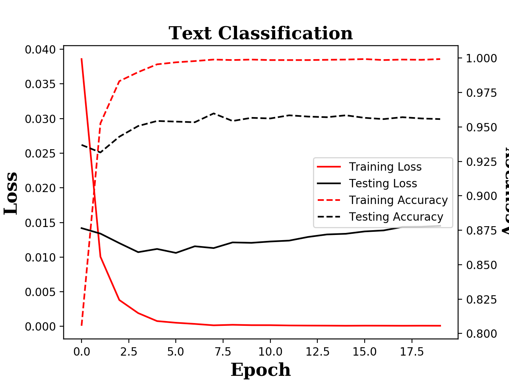

---
Text Classification based on LSTM on R8 Dataset-[pytorch implementation]
---

### 1. Details of file fold:
- data/
- data/train_txt/*.txt
- data/train_txt.txt
- data/train_label.txt
- data/test_txt/*.txt
- data/test_txt.txt
- data/test_label.txt

### 2. File description:

| file | description|
|---|---|
|data/train_txt/|training text fold|
|data/test_txt/|testing text fold|
|data/train_txt.txt|file name list for training text |
|data/test_txt.txt|file name list for testing text |
|data/train_label.txt|label list for training text|
|data/test_label.txt| label list for testing text|

### 3. Running example:
Environment: python 3

Requirements:
```python
pytorch
```
running example:
```python
python main.py
```
output:


### 4. Dataset:
We use the following dataset for our example:
R8 Dataset.[link](http://www.cs.umb.edu/~smimarog/textmining/datasets/).

### 5. Notes:
- This code is largely inspired from the original repo: [jiangqy](https://github.com/jiangqy/LSTM-Classification-Pytorch) with a few modifications:
  - Use the Adam optimizer
  - Custom dataloader
  - Select the right output after the LSTM/GRU (masking)
  - Attention layer included, from [here](https://github.com/wabyking/TextClassificationBenchmark). The attention mechanism is not the full one though, it is a simplified version. No new parameters are learned in the process as it just combines the rnn output with the hidden states using matrix multiplications. This simplified attention mechanism still provides a significant improvements over no attention at all.
- The entire sentences are used. If you want to cap the number of words, please, update the parameter **sentence_len = None** to **sentence_len = n**. You should get pretty descent results even with only 32 words max per sentence.
- There is no early stopping. The code just runs for n epochs and saves the results at the end. But it is easy enough to select the best model based on the evaluation phase.
